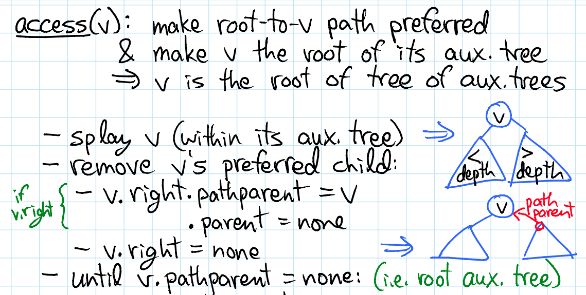

## Dynamic Connectivity Problem

* Graph connectivity problem: Given an undirected graph G, preprocess the graph so that queries of the form "are nodes u and v connected?" can be answered efficiently.
* Dynamic connectivity problem: Maintain an undirected graph G so that edges may be inserted or deleted and connectivity queries can be answered effciently.

Dynamic connectivity in forests can be solved by Euler tour trees.

Goal: Support these three operations:
* link(u, v): Add in edge {u, v}. The assumption is that u and v are in separate trees.
* cut(u, v): Cut the edge {u, v}. The assumption is that the edge exists in the tree.
* are-connected(u, v): Return whether u and v are connected.
* compute(u, root): compute some function on path from u to root

## Link/cut tree

A link/cut tree is a data structure for representing a forest, a set of rooted trees, and offers the following operations:

* Add a tree consisting of a single node to the forest.
* Link: Attach a node to another node as its child.
* Cut: Given a node in one of the trees, disconnect it (and its subtree) from the tree of which it is part.
* Given a node, find the root of the tree to which it belongs. By doing this operation on two distinct nodes, one can check whether they belong to the same tree.

All of these operations are supported by link/cut trees in O(log n) amortized time where n is the size of the tree.

**Structure:** We take a tree where each node has an arbitrary degree of unordered nodes and split it into paths. We call this the represented tree. These paths are represented internally by auxiliary trees (here we will use splay trees, nodes are stored by depth), where the nodes from left to right represent the path from root to the last node on the path. Nodes that are connected in the represented tree that are not on the same preferred path (and therefore not in the same auxiliary tree) are connected via a path-parent pointer. This pointer is stored in the root of the auxiliary tree representing the path.

### Preferred path decomposition

Preferred child of node v:
* None if last access in v's subtree was v
* w if last access was in child w's subtree

Preferred path = chain of preferred edges, preferred paths partitions represented tree into paths.

### Auxiliary trees

Represent each preferred path by a splay tee keyed on **depth**
* root of aux. tree stores path parent - path's top node's parent in represented tree
* aux trees + path parent pointers = tree of auxiliary trees

### Access or Expose

The Expose(v)/Access(v) operation is an extended splay operation that brings v to the root of the auxiliary/virtual tree without changing the structure of the rooted tree. The important parts of this operation are to make sure that the path from v to the root is preferred(solid) and that the splay tree representing the path to which v belongs is rooted at v.

## REF
* https://web.stanford.edu/class/archive/cs/cs166/cs166.1166/lectures/17/Small17.pdf
* https://en.wikipedia.org/wiki/Link/cut_tree
